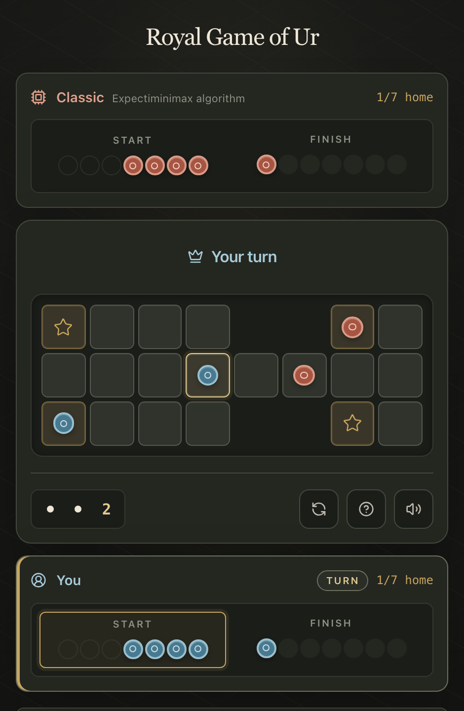

# Royal Game of Ur

[](https://github.com/tre-systems/rgou-cloudflare/actions/workflows/deploy.yml)

<div align="center">
  
  <br />
  <a href="https://ko-fi.com/N4N31DPNUS"></a>
  <hr />
</div>

An offline-first implementation of the ancient Royal Game of Ur with Classic and machine-learning opponents. The React interface runs both Rust/WebAssembly AIs locally in one lazy Web Worker and is served by a Cloudflare Worker with Static Assets.

## Play Now

**[gameofur.org](https://gameofur.org/)** — works in any modern browser, no installation required.

## Features

- **Dual AI**: classic expectiminimax and a neural network trained from simulated games, both running locally through Rust and WebAssembly
- **Non-blocking play**: one lazily created Web Worker hosts every AI engine, keeping search, inference, and model loading off the UI thread
- **Offline-first**: HTML plus its hashed JS/CSS shell are installed atomically while larger AI assets are cached opportunistically
- **Responsive UI**: keyboard-accessible play, restrained motion, reduced-motion support, and sound on desktop and mobile
- **Private by design**: win/loss statistics stay on the device; anonymous lifecycle events are sent to Cloudflare Analytics Engine for aggregate counts when online

## Quick Start

### Prerequisites

- **Node.js 22+** ([download](https://nodejs.org/en/download))
- **Rust & Cargo** ([install](https://www.rust-lang.org/tools/install)) — compiles the AI to WebAssembly
- **wasm-pack**: `cargo install wasm-pack --version 0.12.1 --locked`

### Setup

```bash
git clone https://github.com/tre-systems/rgou-cloudflare.git
cd rgou-cloudflare
npm ci
npm run dev                 # builds WASM, generates the service worker, and starts Vite
```

The game opens at the URL printed by Vite, normally <http://localhost:5173>.

## Testing

```bash
npm run check                    # docs, lint, diagrams, types, Rust, unit, and e2e tests
npm run test:ai-comparison:fast  # quick AI comparison
```

See [DEVELOPMENT.md](./docs/DEVELOPMENT.md) for the full command reference and troubleshooting.

## Documentation

- **[ARCHITECTURE.md](./docs/ARCHITECTURE.md)** — system design, pattern catalogue, dependency rules, data flow, and deployment
- **[Architecture diagrams](./docs/diagrams/README.md)** — Graphviz sources, rendered system views, and visual conventions
- **[AI-SYSTEM.md](./docs/AI-SYSTEM.md)** — AI execution, algorithms, model contract, and genetic evolution
- **[AI-MATRIX-RESULTS.md](./docs/AI-MATRIX-RESULTS.md)** — generated AI win-rate and speed results
- **[DEVELOPMENT.md](./docs/DEVELOPMENT.md)** — commands, testing, and troubleshooting
- **[GAME-GUIDE.md](./docs/GAME-GUIDE.md)** — rules, strategy, and history
- **[ml/README.md](./ml/README.md)** — ML training quick start
- **[worker/rust_ai_core/tests/README.md](./worker/rust_ai_core/tests/README.md)** — Rust test suite

## License

MIT — see [LICENSE](LICENSE).

## Acknowledgments

- **[Irving Finkel and the British Museum](https://www.britishmuseum.org/visit/object-trails/one-hour-museum)** — reconstruction of the surviving rules
- **[RoyalUr.net](https://royalur.net/)** — game analysis and strategy
- The Rust and WebAssembly communities
