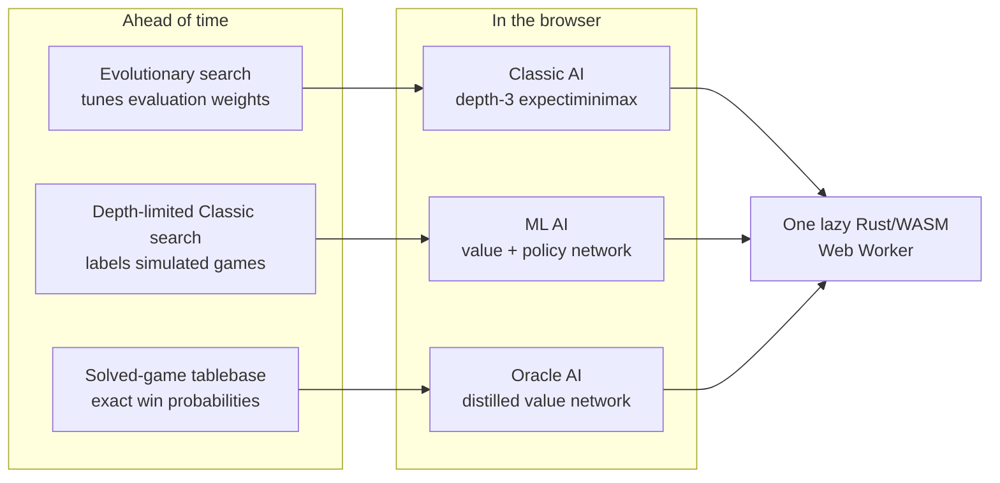
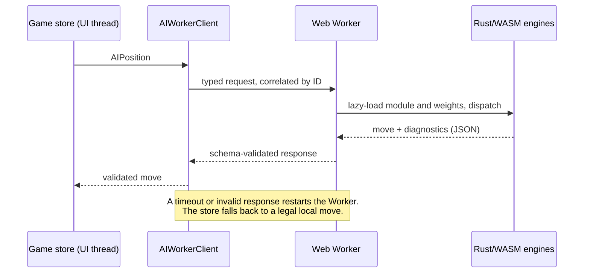
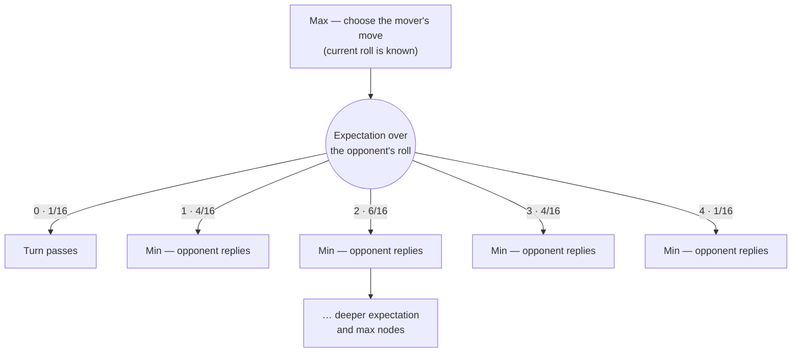
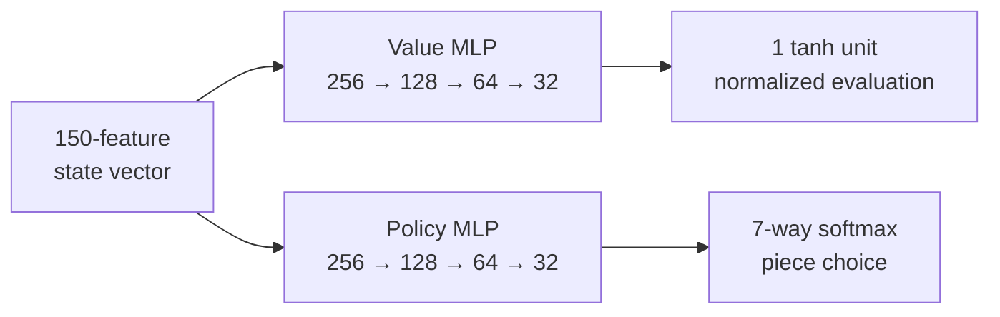
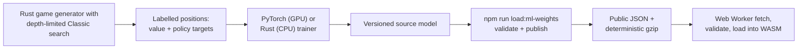

# AI System

The game has three AI opponents, all written in Rust and compiled to WebAssembly. Search and inference run locally; there is no server-side AI service:

- **Classic AI** — [expectiminimax](https://en.wikipedia.org/wiki/Expectiminimax) search with [alpha-beta pruning](https://en.wikipedia.org/wiki/Alpha%E2%80%93beta_pruning) and tunable evaluation parameters
- **ML AI** — a value + policy neural network trained from expectiminimax-labelled simulated games
- **Oracle AI** — a compact value network distilled from the published strong solution of the game

The three are deliberately different answers to the same question. Classic thinks at runtime, searching the game tree on every turn. ML and Oracle think ahead of time: each plays with forward passes through a small network whose strength was fixed during training — ML distils depth-limited Classic search, Oracle approximates exact tablebase values.



| Opponent | Decides a move by                                 | Teacher                              | Learned parameters   |
| -------- | ------------------------------------------------- | ------------------------------------ | -------------------- |
| Classic  | searching the live game tree to depth 3           | evolutionary tuning against defaults | 8 evaluation weights |
| ML       | scoring successors with value and policy networks | depth-limited Classic search         | 164,040              |
| Oracle   | valuing every legal successor's win probability   | the solved-game tablebase            | 29,057               |

The public [AI guide](https://gameofur.org/ai) introduces the three approaches. The broad [AI matrix](./AI-MATRIX-RESULTS.md) compares research fixtures; [deployed matchup results](./AI-DEPLOYED-RESULTS.md) compare the three opponents available in the browser. For Oracle's research, design, and evidence, see [ORACLE-AI.md](./ORACLE-AI.md).

Watch mode accepts an independent choice for each side from Classic, ML, and Oracle. The selected pairing uses the same typed mode policy as normal games and is retained across a page reload.

## Browser execution

The UI never sends a complete `GameState` to AI code. The thin main-thread services share one lazily constructed `AIWorkerClient` (`src/lib/ai-worker-client.ts`), which sends a schema-validated `AIPosition`: seven squares per player, current player, and dice roll. The discriminated Worker protocol correlates each request by ID and times it out after 30 seconds. A timeout, transport failure, or invalid response restarts the Worker and rejects every pending request.



The single [Web Worker](https://developer.mozilla.org/en-US/docs/Web/API/Web_Workers_API) (`src/lib/ai.worker.ts`) lazily loads one Rust/WASM module and dispatches Classic, heuristic, ML, and Oracle requests. Learned weights are fetched inside the Worker: it prefers each gzip asset, uses streaming [`DecompressionStream`](https://developer.mozilla.org/en-US/docs/Web/API/DecompressionStream), parses and validates model metadata, network dimensions, and exact weight counts, then loads the arrays into WASM. A failed, stale, or incompatible compressed artifact falls back to a freshly fetched uncompressed JSON compatibility asset. Search, inference, decompression, JSON parsing, and validation therefore stay off the UI thread.

The TypeScript and Rust rule implementations consume the same `test-fixtures/rules-conformance.json` cases. These fixtures cover entry, blocking, protected rosettes, captures, finishing, overshoot, and mirrored player tracks. Add a shared case whenever rule behavior changes.

## Classic AI

[Expectiminimax](https://en.wikipedia.org/wiki/Expectiminimax) extends [minimax](https://en.wikipedia.org/wiki/Minimax) to games with chance. The mover already knows their own roll before choosing, so chance sits between turns: the search maximizes over the mover's choices, takes the expectation over the opponent's unknown roll, then minimizes over the opponent's replies.



- **Min/Max nodes** for the players' choices; node type follows the rules engine's turn logic, so a rosette landing produces consecutive levels for the same side
- **Expectation nodes** for the dice roll, weighting child values by probability
- **[Alpha-beta pruning](https://en.wikipedia.org/wiki/Alpha%E2%80%93beta_pruning)** to skip branches that cannot affect the result

### Dice probabilities

Four binary dice give a roll of 0–4 — a [binomial distribution](https://en.wikipedia.org/wiki/Binomial_distribution) centred on 2:

| Roll | Probability |
| ---- | ----------- |
| 0    | 1/16        |
| 1    | 4/16        |
| 2    | 6/16        |
| 3    | 4/16        |
| 4    | 1/16        |

### Search depth

The browser Classic AI searches to **depth 3** (`BROWSER_CLASSIC_AI_DEPTH`). This keeps the deliberate search opponent responsive in the Worker. The normal AI matrix benchmarks depths 1–3; slow tests add depth 4 for research only.

The optimized browser instance retains a [transposition table](https://www.chessprogramming.org/Transposition_Table) across requests. A position hash includes all seven pieces for both players, current player, and genetic parameters. The table is bounded at 50,000 entries and clears before inserting beyond the ceiling, preventing an unbounded long-lived Worker cache.

### Evaluation parameters

The evaluation function is driven by a set of weights (`GeneticParams` in `worker/rust_ai_core/src/genetic_params.rs`): win score, finished-piece value, position weight, safety, rosette control, advancement, capture, and center-lane bonuses.

A [genetic algorithm](https://en.wikipedia.org/wiki/Genetic_algorithm) (`cargo run --release --bin evolve_params`) tunes these against the defaults and writes an optimized set to `ml/data/genetic_params/evolved.json`. The Rust build embeds that JSON for native and WASM use; malformed embedded data falls back to the built-in defaults. The evolved set is:

```json
{
  "win_score": 8354,
  "finished_piece_value": 638,
  "position_weight": 30,
  "safety_bonus": -13,
  "rosette_control_bonus": 61,
  "advancement_bonus": 11,
  "capture_bonus": 49,
  "center_lane_bonus": 4
}
```

Evolution and validation:

```bash
npm run evolve:genetic-params     # evolve, save to ml/data/genetic_params/evolved.json
npm run validate:genetic-params   # compare evolved vs default over many games
```

The search runs 50 generations of 50 individuals with 100 games per evaluation. It writes a candidate only when a final 1,000-game validation exceeds a 55% win rate against the defaults.

## ML AI

### Architecture



- **Input**: the same 150-feature game-state vector is supplied to both networks
- **Networks**: independent value and policy [MLPs](https://en.wikipedia.org/wiki/Multilayer_perceptron), each with 256 → 128 → 64 → 32 hidden units (ReLU), 164,040 parameters in total
- **Outputs**: the value network emits 1 tanh unit estimating normalized expectiminimax evaluation; the policy network emits a 7-way softmax over piece choices
- Move scoring combines the successor value from the mover's perspective, current policy probability, and fixed finish/capture/rosette bonuses

The value + policy decomposition is the same one popularized by [AlphaGo Zero](https://www.nature.com/articles/nature24270), with expectiminimax standing in as the teacher instead of tree-search reinforcement learning. The architecture is defined in `ml/config/training.json` and `worker/rust_ai_core/src/features.rs`.

### Training



The data generator uses depth-limited Classic expectiminimax as its only teacher; it does not use the Oracle tablebase or solved-game model. It alternates the starting player between games, and a zero roll or blocked position passes the turn exactly as it does in the game. Each playable position is searched once. The best score becomes a normalized Player 2 value target, forced moves retain their searched value, and equally scored piece choices share the policy target. After recording the label, ten per cent of rollouts take a different legal move so the corpus includes recovery positions. Runtime move selection converts successor values back to the mover's perspective before ranking legal moves. Two training backends share the same presets:

| Backend | Hardware                      | Notes                           |
| ------- | ----------------------------- | ------------------------------- |
| PyTorch | GPU (CUDA or Apple Metal/MPS) | Faster; requires a GPU          |
| Rust    | CPU (parallel)                | Always available; no GPU needed |

Rust self-play derives an independent random stream for each game from the configured seed and game index. Indexed parallel collection keeps both game results and corpus ordering stable regardless of Rayon scheduling or core allocation.

| Preset     | Games | Epochs | Batch |
| ---------- | ----- | ------ | ----- |
| quick      | 100   | 15     | 128   |
| default    | 1000  | 60     | 256   |
| production | 6000  | 120    | 512   |

The PyTorch backend uses AdamW and independent validation-driven learning-rate schedules for the value and policy networks. It restores the checkpoint with the lowest combined validation loss. Candidate models are compared with the current production model, Classic, and Oracle using fixed dice streams and alternating seats before promotion.

See [DEVELOPMENT.md](./DEVELOPMENT.md) and [ml/README.md](../ml/README.md) for training commands.

### Model contract

`ml/data/weights/ml_ai_weights_pytorch_v5.json` is the stable path for the production source model; the filename is retained so deployment code does not depend on experiment names. The current model was distilled from depth-4 Classic AI without Oracle or tablebase data. Its verified metadata records 6,000 simulated games, 980,660 labelled positions, 120 epochs, seed 20260716, and a best validation loss of 0.6061. The Fast, V4, and Hybrid files in the same directory are comparison fixtures for the AI matrix, not deployment sources; their legacy metadata is not treated as authoritative provenance.

`npm run load:ml-weights` validates and publishes the canonical production source to fixed repository-owned destinations. Every artifact declares the `input-output-row-major-v1` matrix layout used by Rust. PyTorch export transposes its native output-by-input matrices into that layout; a shared fixture checks the same linear layer in Python and Rust. `ml/model-manifest.json` records the layout, source revision, training-input hashes, architecture, exact weight counts, and hashes for the source, JSON fallback, and deterministic gzip artifact. `npm run test:model-provenance` prevents those forms from drifting. TypeScript and Rust reject an undeclared layout, incomplete metadata, the wrong architecture, non-finite values, and short or oversized weight arrays.

## Oracle AI

Oracle is a `32 → 128 → 128 → 64 → 1` ReLU value network with a tanh output. Its 32-value canonical input describes current-player and opponent occupancy, reserve counts, and finished counts. It deliberately omits colour identity, dice, piece indices, handcrafted scores, duplicates, and padding.

The teacher is the 16-bit tablebase published with the [2025 strong solution](https://royalur.net/blog/solved) of the Finkel ruleset. Training samples exact pre-roll win probabilities from that external 827 MB artifact; the tablebase never ships to browsers. The production run uses two million training positions, 100,000 validation positions, and 100,000 disjoint test positions. The pinned configuration, source and tablebase hashes, sample identity, candidate results, and held-out metrics are stored with the model.

At runtime Rust enumerates legal moves with the rules engine, evaluates each successor, and converts the successor's current-player probability back to the mover's perspective. A rosette retains the same perspective; a normal turn change uses `1 - V`; an immediate win is `1`. This keeps move legality and turn semantics in the rules engine and avoids a policy head or post-training move bonuses.

The model is an approximation of an exact teacher, not a perfect-play claim. The independent Classic and ML opponents remain available, and the generated matrix reports all three. [ORACLE-AI.md](./ORACLE-AI.md) is the authority for feature semantics, experiment results, promotion gates, reproducibility, and limitations.

## Testing

The Rust test suite covers game logic, the full position hash, the bounded transposition table, every AI type, Oracle symmetry and shared Python/Rust feature fixtures, TypeScript/Rust rule-conformance fixtures, and AI matchups. The deployed benchmark uses deterministic dice, an even number of games, and alternating seats. See [worker/rust_ai_core/tests/README.md](../worker/rust_ai_core/tests/README.md) for commands, [AI-DEPLOYED-RESULTS.md](./AI-DEPLOYED-RESULTS.md) for browser-opponent results, and [AI-MATRIX-RESULTS.md](./AI-MATRIX-RESULTS.md) for the broader matrix.

```bash
npm run test:ai-comparison:fast            # quick matrix (10 games per match)
npm run test:ai-comparison:comprehensive   # 100 games per match, plus slow tests
npm run test:ai-deployed                    # 400 games per browser-opponent pairing
```

## Further reading

- [Expectiminimax](https://en.wikipedia.org/wiki/Expectiminimax) — minimax over game trees that contain chance nodes
- [Ballard, _The \*-minimax search procedure for trees containing chance nodes_ (1983)](https://doi.org/10.1016/s0004-3702%2883%2980015-0) — pruning through expectation nodes
- [Transposition tables — Chess Programming Wiki](https://www.chessprogramming.org/Transposition_Table) — caching searched positions by hash
- [Silver et al., _Mastering the game of Go without human knowledge_ (2017)](https://www.nature.com/articles/nature24270) — the value + policy network pattern
- [Strongly Solving the Royal Game of Ur](https://royalur.net/blog/solved) — the solved game Oracle is distilled from; full sources in [ORACLE-AI.md](./ORACLE-AI.md#sources)
