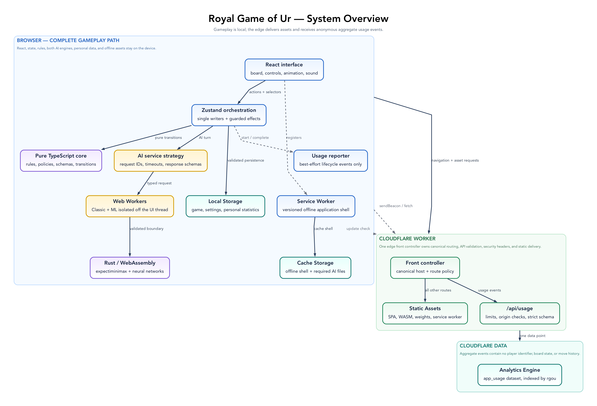
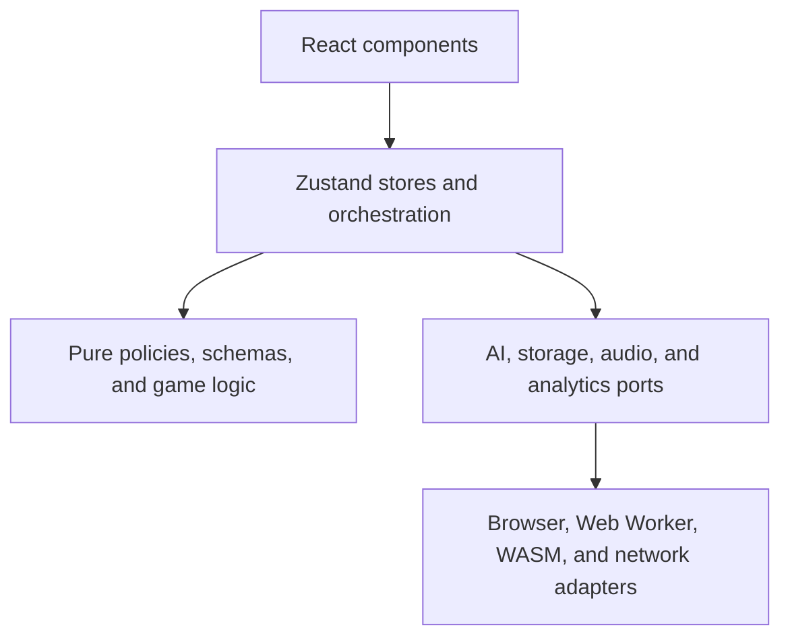
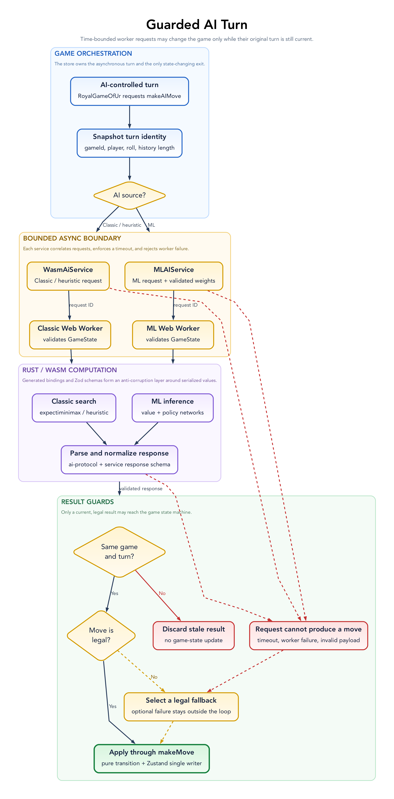

# Architecture

The Royal Game of Ur is a local-first React application built with Vite and served by a small Cloudflare Worker. Its Rust AI engine is compiled to WebAssembly and runs in Web Workers. Gameplay has no server round-trips and remains available offline.

This document is also the project's pattern catalogue. A pattern is useful here only when it gives the code a clear invariant. New code should use the vocabulary and dependency rules below instead of introducing a parallel way to solve the same problem.



The browser cluster is the complete gameplay path. The Cloudflare Worker delivers the application and accepts anonymous aggregate usage events, but gameplay, AI decisions, and personal state do not depend on a server round-trip.

## Architectural principles

- **Local-first** — the browser owns gameplay and personal statistics.
- **Functional core, imperative shell** — rules are pure; stores, React effects, workers, storage, audio, and network calls form the shell.
- **One source of truth** — domain types, mode policy, and state transitions are defined once and derived elsewhere.
- **Validate every untrusted boundary** — persisted data, Worker requests, and WASM JSON are runtime values, not trusted TypeScript objects.
- **Privacy by data minimization** — do not create or retain identifiers when aggregate events are enough.
- **Progressive resilience** — offline play, AI fallbacks, stale-response guards, request timeouts, and best-effort analytics keep optional failures out of the game loop.

## Layers and dependency direction

Dependencies point inward:



`src/lib` must not import React components. Presentational components receive domain data and callbacks through props; they do not reach into stores. Platform APIs belong in adapters or effects, not in pure game logic.

## Pattern catalogue

### Domain and state patterns

| Pattern                            | Invariant                                                                                                 | Implementation                                                                                     |
| ---------------------------------- | --------------------------------------------------------------------------------------------------------- | -------------------------------------------------------------------------------------------------- |
| Schema-first domain model          | A durable or boundary-crossing domain value has one Zod schema and an inferred TypeScript type.           | `src/lib/schemas.ts`, re-exported by `src/lib/types.ts`                                            |
| Functional core / imperative shell | Rules return new values and do not perform I/O; effects are coordinated outside the rules.                | `src/lib/game-logic.ts` is the core; stores, services, and React effects are the shell.            |
| Explicit state machine             | Legal game transitions are centralized and invalid transitions are no-ops or explicit errors.             | `initializeGame`, `processDiceRoll`, `makeMove`, and `endTurn` in `src/lib/game-logic.ts`          |
| Single writer                      | Zustand actions own application-state mutation; components request transitions rather than editing state. | `src/lib/game-store.ts`, `src/lib/ui-store.ts`, `src/lib/stats-store.ts`                           |
| Derived state                      | Values determined by another value are computed, not separately persisted.                                | Opponent mode is persisted; AI assignments and participants are derived by `src/lib/game-mode.ts`. |
| Policy table                       | A closed set of choices is expressed as typed data rather than repeated conditionals.                     | The exhaustive opponent-mode configuration in `src/lib/game-mode.ts`                               |

The state machine deliberately remains a small set of pure transition functions instead of a framework. If transitions gain substantially more states, cross-cutting guards, or replay requirements, move to a reducer driven by explicit domain events; do not spread more transition logic through components.

### Boundary and integration patterns

| Pattern                     | Invariant                                                                                            | Implementation                                                                                   |
| --------------------------- | ---------------------------------------------------------------------------------------------------- | ------------------------------------------------------------------------------------------------ |
| Ports and adapters          | Browser and platform details are isolated behind narrow modules.                                     | AI services, `persist-storage.ts`, `sound-effects.ts`, `observability.ts`, and `usage.ts`        |
| Anti-corruption layer       | External naming and shapes are translated before entering the domain model.                          | WASM snake-case responses are validated and mapped through `ai-protocol.ts` and the AI services. |
| Runtime boundary validation | `unknown` is parsed before use; type assertions do not substitute for validation.                    | Persisted-state schemas, usage-event schema, Worker request limits, AI protocol schemas          |
| Strategy                    | The selected AI source chooses an adapter while the game store consumes one normalized `AIResponse`. | `WasmAiService`, `MLAIService`, and `makeAIMove`                                                 |
| Async result guard          | A delayed result may update state only if it still belongs to the active game and turn.              | `gameId` and turn snapshot checks in `game-store.ts`                                             |
| Bounded request lifecycle   | Every Worker request resolves, rejects, or times out; worker failure rejects pending work.           | Request maps and timeouts in both AI services                                                    |
| Graceful fallback           | An optional subsystem failure degrades locally without corrupting the state machine.                 | AI services choose a legal fallback move; usage reporting ignores network failure.               |

Messages between the main thread, Web Workers, and WASM are boundary data even though all code ships together. Validate them because Rust models, generated bindings, and TypeScript can evolve independently.

### UI patterns

| Pattern                  | Invariant                                                                                                 | Implementation                                                          |
| ------------------------ | --------------------------------------------------------------------------------------------------------- | ----------------------------------------------------------------------- |
| Container / presentation | The root game component selects state and owns effects; board components render props and emit callbacks. | `RoyalGameOfUr.tsx` coordinates `GameBoard.tsx` and `components/game/`. |
| Local transient state    | Animation and DOM-measurement state stays near the component that owns its lifecycle.                     | `GameBoard.tsx` animation collections and board ref                     |
| Error boundary           | An unexpected render failure has a safe recovery surface and privacy-filtered reporting.                  | `AppErrorBoundary.tsx`, `observability.ts`                              |
| Stable test seam         | Critical UI controls expose semantic roles or stable `data-testid` selectors for browser tests.           | `src/components/`, `e2e/smoke.spec.ts`                                  |

Components may contain display decisions and transient animation state. Reusable rules, mode decisions, validation, persistence, and network behavior belong in `src/lib` so they can be unit-tested without rendering React.

### Data, privacy, and delivery patterns

| Pattern                      | Invariant                                                                                                     | Implementation                                                    |
| ---------------------------- | ------------------------------------------------------------------------------------------------------------- | ----------------------------------------------------------------- |
| Local-first persistence      | In-progress games, settings, and personal statistics remain in local storage and are validated when restored. | Zustand persistence plus `persist-storage.ts`                     |
| Data minimization            | Analytics contain only the dimensions required for aggregate product questions.                               | `usage.ts`; startup removes the retired `rgou-player-id` key.     |
| Best-effort domain events    | Telemetry observes lifecycle transitions but never participates in them.                                      | `game_started` and `game_completed` via `/api/usage`              |
| Front controller             | The edge Worker owns canonical-host policy and API routing before delegating to static assets.                | `src/worker.ts`, `canonical-host.ts`                              |
| Offline application shell    | Versioned static assets and required AI files are cached; update behavior is explicit.                        | generated service worker and `ServiceWorkerUpdate.tsx`            |
| Build once, promote artifact | CI tests, builds the Worker artifact, deploys that artifact, then tests production.                           | `.github/workflows/deploy.yml`, `vite.config.ts`, `wrangler.toml` |
| Diagram as code              | Relationship-heavy views have reviewable DOT sources, committed renders, one question each, and CI validation. | `docs/diagrams/`, `scripts/render-diagrams.mjs`, `scripts/check-diagrams.mjs` |

## Frontend structure

- `src/components/` — React containers, presentational game UI, and animations
- `src/lib/schemas.ts` — canonical domain schemas and inferred types
- `src/lib/game-logic.ts` — pure rules and state transitions
- `src/lib/game-mode.ts` — exhaustive opponent-mode policy and derived AI assignments
- `src/lib/game-store.ts` — game orchestration and guarded asynchronous AI turns
- `src/lib/ui-store.ts` and `stats-store.ts` — focused UI and personal-statistics stores
- `src/lib/ai-protocol.ts` — validated WASM response contracts
- `src/lib/wasm-ai-service.ts` and `ml-ai-service.ts` — main-thread AI adapters
- `src/lib/ai.worker.ts` and `ml-ai.worker.ts` — isolated Web Worker/WASM adapters
- `src/lib/usage.ts` — anonymous lifecycle event contract and Analytics Engine mapping
- `src/worker.ts` — edge front controller, API validation, security headers, and static assets

`RoyalGameOfUr.tsx` is intentionally the orchestration container. If it continues to grow, extract cohesive effect-owning hooks such as turn scheduling or sound coordination; do not move domain decisions back into leaf components.

## Principal flows

### AI turn



1. `RoyalGameOfUr.tsx` derives whether the active player is AI-controlled from `game-mode.ts`.
2. `makeAIMove` snapshots the active game and turn.
3. The selected AI adapter sends validated state to its Web Worker.
4. The worker calls Rust/WASM and validates the returned JSON through `ai-protocol.ts`.
5. The store discards stale results, normalizes diagnostics, and applies a legal move through `makeMove`.
6. Failure or timeout falls back to a legal local move.

### Persistence

1. Zustand persists only the selected subset of each store.
2. Stored values are treated as `unknown` during hydration.
3. Zod validates game and statistics invariants.
4. Invalid or obsolete data falls back to safe defaults; the retired player identifier is deleted at startup.

### Usage event

1. Starting or finishing a game creates a typed anonymous domain event.
2. `sendBeacon` is preferred, with a non-blocking `fetch` fallback.
3. The same-origin Worker limits method, origin, media type, and body size, then validates the strict schema.
4. The Worker writes one Analytics Engine point indexed by `rgou`.
5. Any reporting failure is isolated from gameplay.

## Persistence and analytics

In-progress games, settings, and personal win/loss statistics are stored only in browser local storage. Watch-mode matches are excluded from personal statistics.

The app has no database. It reports only `game_started` and `game_completed` events to the shared account-level Analytics Engine dataset `app_usage`, indexed by `rgou`. Events contain mode, anonymous participant categories, starting side, and—on completion—winner, move count, and duration. They contain no player identifier, user agent, board state, or move history.

## AI engine

Both AIs are Rust compiled to WebAssembly and run in Web Workers, so search never blocks the UI:

- **Classic AI** — expectiminimax with alpha-beta pruning
- **ML AI** — value and policy neural networks

See [AI-SYSTEM.md](./AI-SYSTEM.md) for algorithms and models. The Rust core is `worker/rust_ai_core/src/lib.rs`; WASM bindings are in `worker/rust_ai_core/src/wasm_api.rs`.

## Deployment

The application deploys as a Cloudflare Worker with Static Assets through the Cloudflare Vite plugin. GitHub Actions runs `npm run check`, builds with Vite, deploys the generated Wrangler configuration, and smoke-tests production. Configuration lives in `wrangler.toml`; the canonical site is `https://gameofur.org`.

The Worker permanently redirects `www.gameofur.org`, `gameofur.net`, `www.gameofur.net`, and `rgou.tre.systems` while preserving path and query. It owns `/api/usage` and delegates all other requests to Static Assets with SPA fallback. No D1 or R2 binding is required.

WASM requires cross-origin isolation headers, configured in `public/_headers`:

```text
/wasm/*
  Cross-Origin-Embedder-Policy: require-corp
  Cross-Origin-Opener-Policy: same-origin
  Cross-Origin-Resource-Policy: same-origin
```

## Patterns deliberately not used

- **Repository / unit of work / data mapper** — there is no application database.
- **CQRS or event sourcing** — current state transitions and two telemetry events do not justify separate command, query, or event-log models.
- **Dependency-injection container** — module-level adapters and explicit function arguments are sufficient at this size.
- **Application event bus** — direct store actions and callbacks make control flow easier to trace.
- **SSR or server components** — gameplay is local, offline-first, and depends on browser workers and WASM.
- **Microservices** — the static application and small edge front controller are one deployable unit.

Adopt one of these only when a concrete requirement creates its characteristic problem. Do not introduce a pattern merely to make the architecture look more elaborate.

## Development and production

- **Development:** AI diagnostics, AI toggle, and reset/test controls are available locally.
- **Production:** developer controls are absent; assets are optimized; canonical redirects, privacy-filtered error reporting, and best-effort Analytics Engine counters are enabled.

The Rust crate also exposes native binaries for training and evaluation. They are tooling, not part of the web deployment.
