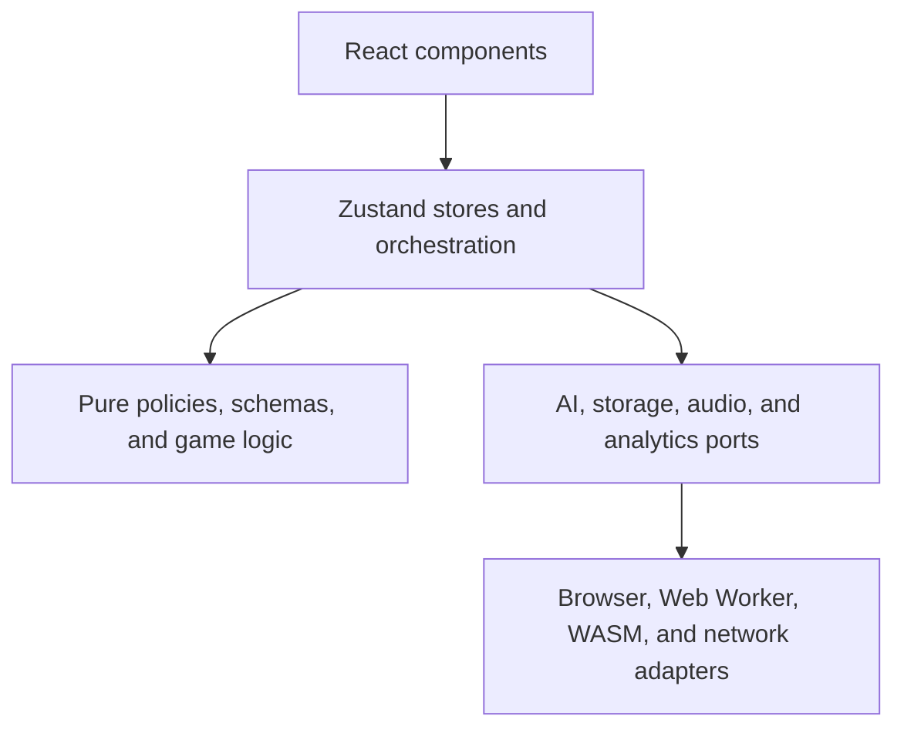
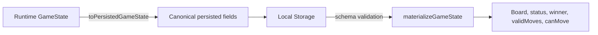

# Architecture

The Royal Game of Ur is a local-first React application built with Vite and served by a small Cloudflare Worker. Its three Rust AI opponents are compiled to WebAssembly and run in one lazy Web Worker.

This document is also the project's pattern catalogue. A pattern is useful here only when it gives the code a clear invariant. New code should use the vocabulary and dependency rules below instead of introducing a parallel way to solve the same problem.

The browser cluster is the complete gameplay path. The Cloudflare Worker delivers the application and accepts anonymous lifecycle events for aggregate reporting, but gameplay, AI decisions, and personal state do not depend on a server round-trip.

## Architectural principles

- **Local-first** — the browser owns gameplay and personal statistics.
- **Functional core, imperative shell** — rules are pure; stores, React effects, workers, storage, audio, and network calls form the shell.
- **Explicit sources of truth** — persisted state is canonical, projections are rebuilt, mode policy is defined once, and the TypeScript and Rust rules are kept aligned by shared conformance fixtures.
- **Deterministic core** — starting-player and dice entropy can be injected; tests and simulations do not depend on ambient randomness.
- **Validate every untrusted boundary** — persisted data, Worker requests, and WASM JSON are runtime values, not trusted TypeScript objects.
- **Privacy by data minimization** — do not create or retain identifiers when anonymous lifecycle events are enough.
- **Progressive resilience** — offline play, online-only monitoring, AI fallbacks, stale-response guards, request timeouts, and best-effort analytics keep optional failures out of the game loop.

## Layers and dependency direction

Dependencies point inward:

`src/lib` must not import React components. Leaf presentation components receive domain data and callbacks through props; the root orchestration component is the store-facing container. Platform APIs belong in adapters or effects, not in pure game logic.

## Pattern catalogue

### Domain and state patterns

| Pattern                            | Invariant                                                                                                 | Implementation                                                                            |
| ---------------------------------- | --------------------------------------------------------------------------------------------------------- | ----------------------------------------------------------------------------------------- |
| Schema-first domain model          | A durable or boundary-crossing domain value has one Zod schema and an inferred TypeScript type.           | `src/lib/schemas.ts`, re-exported by `src/lib/types.ts`                                   |
| Functional core / imperative shell | Rules return new values and do not perform I/O; effects are coordinated outside the rules.                | `src/lib/game-logic.ts` is the core; stores, services, and React effects are the shell.   |
| Explicit state machine             | Legal game transitions are centralized and invalid transitions are no-ops or explicit errors.             | `initializeGame`, `processDiceRoll`, `makeMove`, and `endTurn` in `src/lib/game-logic.ts` |
| Single writer                      | Zustand actions own application-state mutation; components request transitions rather than editing state. | `src/lib/game-store.ts`, `src/lib/ui-store.ts`, `src/lib/stats-store.ts`                  |
| Canonical state / projections      | Persistence contains only irreducible state and bounded history; derived gameplay fields are rebuilt.     | `PersistedGameStateSchema`, `materializeGameState`, and `toPersistedGameState`            |
| Injected entropy                   | Random choices can be reproduced by supplying a controlled source.                                        | `RandomSource`, `initializeGame`, `rollDice`, and `processDiceRoll` in `game-logic.ts`    |
| Derived random streams             | Parallel simulations derive one stable stream per game; scheduling cannot change results or ordering.     | `TrainingConfig.seed` and the indexed parallel generator in Rust `training.rs`            |
| Balanced simulation corpus         | Successive simulations alternate seats so a learned strategy does not inherit a fixed starting-side bias. | `starting_player_for_game` in Rust `training.rs`; seat splits in the deployed benchmark    |
| Cross-language conformance         | The TypeScript UI rules and Rust AI rules must agree on the same positions.                               | `test-fixtures/rules-conformance.json` is consumed by Vitest and Cargo integration tests. |
| Declared model layout              | Serialized matrices name their memory order and match the training and runtime implementations.           | `weight_layout.py`, `ml-weight-layout.json`, model provenance, Zod, and Rust                |
| Policy table                       | A closed set of choices is expressed as typed data rather than repeated conditionals.                     | Opponent modes and configurable watch matchups in `src/lib/game-mode.ts`                  |
| Canonical representation           | Equivalent positions have one model input regardless of player colour or interchangeable piece identity.  | Oracle's `canonical-finkel-v1` features in `oracle_ai.rs` and `oracle_tablebase.py`       |
| Perspective-aligned scoring        | A model value is converted to the mover's viewpoint before legal moves are ranked.                        | `value_for_player` in `ml_ai.rs`; successor conversion in `oracle_ai.rs`                  |

The state machine deliberately remains a small set of pure transition functions instead of a framework. If transitions gain substantially more states, cross-cutting guards, or replay requirements, move to a reducer driven by explicit domain events; do not spread more transition logic through components.

### Boundary and integration patterns

| Pattern                     | Invariant                                                                                        | Implementation                                                                                     |
| --------------------------- | ------------------------------------------------------------------------------------------------ | -------------------------------------------------------------------------------------------------- |
| Ports and adapters          | Browser and platform details are isolated behind narrow modules.                                 | AI services, `persist-storage.ts`, `sound-effects.ts`, `observability.ts`, and `usage.ts`          |
| Anti-corruption layer       | External naming and shapes are translated before entering the domain model.                      | WASM snake-case responses are validated and mapped through `ai-protocol.ts` and the AI services.   |
| Runtime boundary validation | `unknown` is parsed before use; type assertions do not substitute for validation.                | Persisted-state schemas, usage-event schema, Worker request limits, AI protocol schemas            |
| Strategy                    | The selected engine changes computation, not the main-thread transport or game-store contract.   | Classic, ML, and Oracle services share `AIWorkerClient`; the store consumes only the validated move. |
| Narrow boundary DTO         | AI work receives positions, not UI, history, board projections, or persistence state.            | `AIPositionSchema` and `toAIPosition` in `ai-protocol.ts`                                          |
| Typed Worker RPC            | One discriminated protocol validates requests and responses and correlates them by ID.           | `AIWorkerRequestSchema`, `AIWorkerResponseSchema`, and `AIWorkerClient`                            |
| Async result guard          | A delayed result may update state only if it still belongs to the active game and turn.          | `gameId` and turn snapshot checks in `game-store.ts`                                               |
| Bounded resource lifecycle  | Requests time out and restart a failed Worker; persistent search memory has an explicit ceiling. | `AIWorkerClient`; the Classic transposition table clears before exceeding 50,000 entries.          |
| Graceful fallback           | An optional subsystem failure degrades locally without corrupting the state machine.             | The game orchestration chooses the first legal move deterministically; usage failures are ignored. |

Messages between the main thread, the Web Worker, and WASM are boundary data even though all code ships together. Validate them because Rust models, generated bindings, and TypeScript can evolve independently.

### UI patterns

| Pattern                  | Invariant                                                                                                    | Implementation                                                                      |
| ------------------------ | ------------------------------------------------------------------------------------------------------------ | ----------------------------------------------------------------------------------- |
| Container / presentation | The root game component selects state; focused hooks own effect lifecycles; board components render props.   | `RoyalGameOfUr.tsx`, `useGameTurnScheduler`, `useGameAudio`, and `components/game/` |
| Local transient state    | Animation and DOM-measurement state stays near the component that owns its lifecycle.                        | `GameBoard.tsx` animation collections and board ref                                 |
| Design tokens            | Palette, surfaces, focus treatment, and shared interaction states have one definition.                       | CSS custom properties and primitives in `src/globals.css`                           |
| Purposeful motion        | Motion communicates navigation or game feedback; decorative loops are avoided and reduced motion is honored. | `MotionConfig`, game feedback components, and the reduced-motion CSS override       |
| Flow-first responsive UI | Primary actions remain reachable without overlays; secondary links stay in document flow at every width.     | Mode selection, game controls, footer, and Playwright mobile coverage               |
| Error boundary           | An unexpected render failure has a safe recovery surface and privacy-filtered reporting.                     | `AppErrorBoundary.tsx`, `observability.ts`                                          |
| Stable test seam         | Critical UI controls expose semantic roles or stable `data-testid` selectors for browser tests.              | `src/components/`, `e2e/smoke.spec.ts`                                              |

Components may contain display decisions and transient animation state. Reusable rules, mode decisions, validation, persistence, and network behavior belong in `src/lib` so they can be unit-tested without rendering React.

### Data, privacy, and delivery patterns

| Pattern                         | Invariant                                                                                                                            | Implementation                                                                      |
| ------------------------------- | ------------------------------------------------------------------------------------------------------------------------------------ | ----------------------------------------------------------------------------------- |
| Local-first persistence         | In-progress games, settings, and personal statistics remain in local storage and are validated when restored.                        | Zustand persistence plus `persist-storage.ts`                                       |
| Data minimization               | Analytics contain only the dimensions required for aggregate product questions.                                                      | `usage.ts`; startup removes the retired `rgou-player-id` key.                       |
| Best-effort domain events       | Telemetry observes lifecycle transitions but never participates in them.                                                             | `game_started` and `game_completed` via `/api/usage`                                |
| Front controller                | The edge Worker owns canonical-host policy and API routing before delegating to static assets.                                       | `src/worker.ts`, `canonical-host.ts`                                                |
| Tiered offline precache         | The complete built application, including lazy chunks, is required; large AI assets are optional; health and API routes stay online. | generated service worker plus its Node and browser contract tests                   |
| Intentional code splitting      | Optional or heavy UI infrastructure does not inflate the initial application chunk.                                                  | Lazy Sentry imports and the animation vendor group in `vite.config.ts`               |
| Serialized verified release     | Only the newest run for a ref deploys; production reports and smoke-tests the exact commit identity.                                 | workflow concurrency, `/healthz`, `X-App-Release`, production smoke test            |
| Supply-chain gate               | Known high-severity advisories block deployment; update automation cannot silently change executable CI code.                        | Audits, lockfiles, immutable action SHAs, Dependabot, and GitHub code scanning      |
| Diagram as code                 | Relationship-heavy views have reviewable DOT sources, committed renders, one question each, and CI validation.                       | `docs/diagrams/`, `scripts/render-diagrams.mjs`, `scripts/check-diagrams.mjs`       |
| Exact teacher / compact student | A large solved-game artifact is used only for training; the browser receives a small approximating model with pinned provenance.     | Oracle training and promotion; see [ORACLE-AI.md](./ORACLE-AI.md)                   |
| Evidence-gated promotion        | A model reaches production only after held-out error, legal-play, matchup, latency, size, and provenance checks pass.                | Oracle evaluation gates, the research matrix, and the seat-balanced deployed benchmark |

## Frontend structure

- `src/components/` — React containers, focused mode/game presentation, and animations
- `src/hooks/` — focused React effect lifecycles such as turn scheduling and sound coordination
- `src/lib/schemas.ts` — canonical domain schemas and inferred types
- `src/lib/game-logic.ts` — pure rules, state transitions, persistence projections, and injectable entropy
- `src/lib/game-mode.ts` — exhaustive opponent-mode policy, validated watch matchups, and derived AI assignments
- `src/lib/game-store.ts` — game orchestration and guarded asynchronous AI turns
- `src/lib/ui-store.ts` and `stats-store.ts` — focused UI and personal-statistics stores
- `src/lib/ai-protocol.ts` — narrow `AIPosition` and validated Worker/WASM contracts
- `src/lib/ai-worker-client.ts` — lazy Worker ownership, request correlation, timeout, and restart
- `src/lib/` AI service modules — thin engine-specific response adapters
- `src/lib/ai.worker.ts` — the single Worker/WASM adapter for Classic, heuristic, ML, and Oracle engines
- `src/lib/usage.ts` — anonymous lifecycle event contract and Analytics Engine mapping
- `src/worker.ts` — edge front controller, API validation, security headers, and static assets

`RoyalGameOfUr.tsx` is the orchestration container, `ModeSelection.tsx` owns mode presentation, and `useGameTurnScheduler` and `useGameAudio` own cohesive effect lifecycles. Do not move domain decisions back into leaf components.

## Principal flows

### AI turn

1. `useGameTurnScheduler` derives whether the active player is AI-controlled from `game-mode.ts`.
2. `makeAIMove` snapshots the active game and turn.
3. A thin engine adapter asks the shared lazy `AIWorkerClient` to send a validated `AIPosition`.
4. The single Worker lazily loads WASM, dispatches to Classic, heuristic, ML, or Oracle, and validates the returned JSON through `ai-protocol.ts`.
5. For a learned engine, the Worker fetches, streams gzip decompression, parses, validates, and loads the matching model without blocking the UI thread. A failed or stale compressed artifact falls back to a freshly fetched uncompressed model.
6. The store discards stale results and applies a legal move through `makeMove`.
7. Failure, timeout, invalid data, or an illegal suggestion falls back to a legal local move; timeout also restarts the Worker.

### Persistence

1. Zustand converts runtime `GameState` to `PersistedGameState`, retaining pieces, current player, roll, the latest 512 history entries, and optional start time. The store separately retains the original starting player for completion analytics.
2. Stored values are treated as `unknown`; Zod validates the canonical representation during hydration.
3. `materializeGameState` rebuilds board occupancy, game status, winner, legal moves, and `canMove` from canonical fields.
4. Invalid or obsolete data falls back to safe defaults; the retired player identifier is deleted at startup.

### Usage event

1. Starting or finishing a game creates a typed anonymous domain event.
2. `sendBeacon` is preferred, with a non-blocking `fetch` fallback.
3. The same-origin Worker limits method, origin, media type, and body size, then validates the strict schema.
4. The Worker writes one Analytics Engine point indexed by `rgou`.
5. Any reporting failure is isolated from gameplay.

## Persistence and analytics

In-progress games, settings, the selected watch matchup, and personal win/loss statistics are stored only in browser local storage. Watch-mode matches are excluded from personal statistics.

The app has no database. It reports only `game_started` and `game_completed` events to the shared account-level Analytics Engine dataset `app_usage`, indexed by `rgou`. [Analytics Engine retains data for three months](https://developers.cloudflare.com/analytics/analytics-engine/limits/#data-retention); this dataset is operational aggregate telemetry, not historical product data. Events contain mode, anonymous participant categories, starting side, and—on completion—winner, move count, and duration. They contain no player identifier, user agent, board state, or move history.

## Deployment

The application deploys as a Cloudflare Worker with Static Assets through the Cloudflare Vite plugin. GitHub Actions audits JavaScript and Rust dependencies, runs `npm run check`, builds with the commit SHA, deploys the generated Wrangler configuration, and smoke-tests production. Per-ref concurrency cancels obsolete workflow runs so an older release cannot overtake a newer one. `/healthz` and `X-App-Release` expose the deployed SHA, and the production smoke test requires it to match. The same test exercises every configured alias with a non-root path and query, requiring a permanent redirect to the canonical origin without losing either component. Configuration lives in `wrangler.toml`; the canonical site is `https://gameofur.org`.

The Worker permanently redirects `www.gameofur.org`, `gameofur.net`, `www.gameofur.net`, and `rgou.tre.systems` while preserving path and query. It owns `/api/usage` and delegates all other requests to Static Assets with SPA fallback. No D1 or R2 binding is required.

Regular single-threaded WebAssembly does not require cross-origin isolation. The application deliberately does not send COOP/COEP merely for `.wasm` files: those response headers would not isolate the top-level browsing context. If shared memory or threaded WASM is introduced, isolation must be enabled for the document and every participating resource, then verified with `crossOriginIsolated`. The current deployment uses CSP, HSTS, MIME sniffing protection, frame denial, a same-origin resource policy, and a restrictive permissions policy. It does not opt into cross-origin isolation.

The usage route accepts only same-origin JSON POSTs, rejects encoded and oversized bodies, validates the parsed event against a strict schema, and fails closed when Analytics Engine is unavailable. Error reports strip request bodies, query strings, identity, nested game data, credentials, and URL queries before leaving the browser.

## Patterns deliberately not used

- **Repository / unit of work / data mapper** — there is no application database.
- **CQRS or event sourcing** — current state transitions and two telemetry events do not justify separate command, query, or event-log models.
- **Dependency-injection container** — module-level adapters and explicit function arguments are sufficient at this size.
- **Application event bus** — direct store actions and callbacks make control flow easier to trace.
- **SSR or server components** — gameplay is local, offline-first, and depends on browser workers and WASM.
- **Microservices** — the static application and small edge front controller are one deployable unit.
- **Preact compatibility mode** — React is retained because the current Zustand, Framer Motion, Sentry, and React 19 integration is proven; framework replacement is not a measured bottleneck.
- **ONNX Runtime or WebGPU inference** — the small Rust/WASM network does not justify another runtime without benchmark evidence.

Adopt one of these only when a concrete requirement creates its characteristic problem. Do not introduce a pattern merely to make the architecture look more elaborate.

## Development and production

- **Development:** square labels and a near-winning-state control support local testing.
- **Production:** developer controls are absent; assets are optimized; canonical redirects, privacy-filtered error reporting, and best-effort Analytics Engine telemetry are enabled.

The Rust crate also exposes native binaries for training and evaluation. They are tooling, not part of the web deployment.
