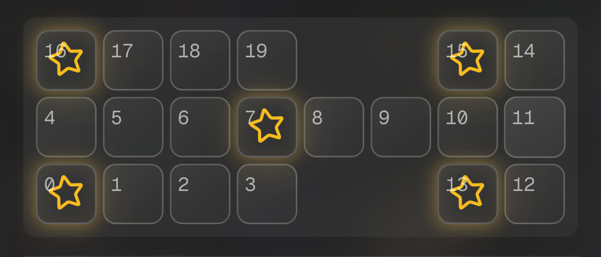

# Game Guide

The Royal Game of Ur — history, rules, strategy, and the AI opponents.

## History

The Royal Game of Ur is one of the oldest known board games. Surviving boards from the Royal Cemetery of Ur date to the third millennium BCE. Irving Finkel of the British Museum reconstructed a playable ruleset from a later cuneiform tablet; this application implements that commonly played modern ruleset.

## How the game works

Two players race all seven of their pieces along a track and off the board. Each turn you roll four binary dice (a result of 0–4) and move one piece that far along your track.

### Board

- 20 squares, with a shared center lane (squares 4–11)
- Rosette squares: **0, 7, 13, 15, 16** (grant an extra turn and cannot be captured)
- Pieces start off the board and finish off the end of the track

Each player follows their own track, sharing only the center lane:

- **Player 1**: 3 → 2 → 1 → 0 → 4 → 5 → 6 → 7 → 8 → 9 → 10 → 11 → 12 → 13 → off
- **Player 2**: 19 → 18 → 17 → 16 → 4 → 5 → 6 → 7 → 8 → 9 → 10 → 11 → 14 → 15 → off

### Rules

- **Move**: roll the dice, then move one piece that many squares along your track. A roll of 0 is a missed turn.
- **Finish**: bearing off requires the exact roll; you cannot overshoot.
- **Capture**: landing on an opponent's piece sends it back to the start — except on a rosette, where pieces are safe and cannot be captured.
- **Extra turn**: landing on a rosette lets you roll again.
- **Win**: the first player to bear off all seven pieces wins.

## Strategy

- **Hold the rosettes**, especially the shared square 7 — they give free turns and protect your pieces.
- **Spread out** so you threaten several captures and do not block your own landing squares.
- **Capture pieces near the end of their track** — sending them back costs the opponent the most.
- **Mind the roll of 0** and the odds: 2 is the most likely roll (6/16), 0 and 4 the least (1/16 each). Don't leave a key move depending on a rare roll.
- **Late game, prioritize bearing off** over chasing captures, and keep vulnerable pieces on rosettes.

## AI opponents

All three AIs run locally in the browser. See [AI-MATRIX-RESULTS.md](./AI-MATRIX-RESULTS.md) for win rates and speed, and [AI-SYSTEM.md](./AI-SYSTEM.md) for how they work.

- **Classic AI** (default): expectiminimax search to depth 4 with alpha-beta pruning. Strong positional play; values rosettes and safe moves.
- **ML AI**: a value + policy neural network trained from expectiminimax-labelled simulated games.
- **Oracle AI**: a compact value network trained on positions from the solved game. It estimates each legal successor's long-term win probability; it does not load the 827 MB solution into your browser or claim mathematically perfect play. See the [Oracle AI write-up](./ORACLE-AI.md).
- **AI vs AI**: choose Classic, ML, or Oracle independently for each side and watch the match play automatically.

## Further reading

- [British Museum: Royal Game of Ur](https://www.britishmuseum.org/visit/object-trails/one-hour-museum) — the game's early history and Irving Finkel's reconstruction
- [British Museum: cuneiform rules tablet](https://www.britishmuseum.org/collection/object/W_Rm-III-6-b) — the surviving instructions for the game of 20 squares
- [Tom Scott vs Irving Finkel (YouTube)](https://www.youtube.com/watch?v=WZskjLq040I) — the British Museum curator teaches the game
- [Strongly Solving the Royal Game of Ur](https://royalur.net/solved) — how researchers computed optimal play
