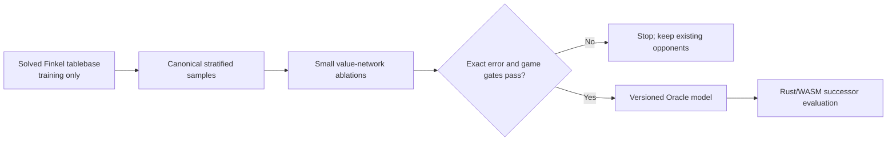

# Oracle AI

Oracle AI is a compact neural opponent distilled from the published strong solution of the Finkel ruleset. This document records why the model exists, the patterns behind it, the reproducible training process, and the evidence required before replacing any existing opponent.

The existing Classic and self-play ML opponents remain available. Oracle AI is an additional strategy, not a silent replacement.

## Why this approach

Padraig Lamont and Jeroen Olieslagers strongly solved the Finkel ruleset in 2025 using Bellman value iteration. Their solution contains the optimal light-player win probability for every reachable pre-roll position. Player symmetry reduces 276 million reachable states to 138 million stored entries. See the [solution report](https://royalur.net/file/solved/Solving_the_RGU_Report.pdf), [explanation](https://royalur.net/blog/solved), and [MIT-licensed model repository](https://huggingface.co/sothatsit/RoyalUrModels).

The tablebase header declares the exact configuration used by this application: a standard board, Bell's path, seven pieces, four binary dice, safe rosettes, extra rolls on rosettes, and no extra roll for captures. Training verifies those fields and the pinned SHA-256 before reading any values.

The complete 16-bit tablebase is 827 MB, so deploying it would work against the local-first architecture. Distillation transfers its exact probabilities into a small model that runs in the existing Rust/WebAssembly Worker.



## Pattern catalogue

| Pattern | Invariant | Consequence |
| --- | --- | --- |
| Exact teacher / compact student | Training labels come from the solved tablebase, never a heuristic score. | More training cannot amplify a search heuristic's preferences. |
| Canonical current-player view | Inputs always describe the side to move as `current`, regardless of display colour. | One model handles both players and cannot invert their objective. |
| Semantic occupancy | Identical pieces are represented by occupied squares and counts, not persistent piece numbers. | Renumbering equivalent pieces cannot change a prediction. |
| Legal successor enumeration | The rules engine creates candidate states; the network only evaluates them. | Invalid-action masking and a policy head are unnecessary. |
| Soft value distillation | Targets retain exact win probability rather than only the best move. | Close alternatives and calibration remain measurable. |
| Evidence-gated scaling | A pilot compares architectures and losses before a production run. | Compute is spent only after measured improvement. |
| Immutable provenance | The tablebase hash, sample identity, source revision, architecture, seeds, and metrics travel with the model. | A deployed result can be audited and reproduced. |

## Canonical feature schema

`canonical-finkel-v1` contains 32 normalized values:

1. Six private-square occupancy values for the current player, in track order.
2. Six private-square occupancy values for the opponent.
3. Eight shared-lane occupancy values for the current player.
4. Eight shared-lane occupancy values for the opponent.
5. Current and opponent reserve counts, divided by seven.
6. Current and opponent finished counts, divided by seven.

The schema contains no player identity, dice roll, handcrafted strategy score, duplicated feature, or padding. Dice are excluded because the tablebase value describes a pre-roll position.

## Move selection

For a known roll, Rust enumerates every legal move and evaluates the resulting pre-roll state:

- A winning move has value `1`.
- After a normal move, the opponent is now current, so the mover's value is `1 - V(successor)`.
- After a rosette move, the mover keeps the turn, so the value is `V(successor)`.

The highest value wins. Equivalent reserve pieces produce equivalent successors and the lowest stable piece index breaks the tie. No capture, finish, or rosette bonus is added after training.

## Training

The tablebase is external scratch data and must never be committed. Download the pinned artifact to `${RGOU_TRAINING_DATA_DIR:-~/Desktop/rgou-training-data}/finkel.rgu`, then run:

```bash
npm run train:oracle:pilot
npm run train:oracle:production
```

`ml/config/oracle-training.json` defines the artifact URL and hash, feature schema, sample counts, architectures, losses, seeds, and optimization parameters. `ml/scripts/train_oracle.py` memory-maps the file, samples without replacement, keeps validation and test states disjoint, restores the best validation checkpoint, and exports weights in Rust's matrix order.

The pilot compares two compact architectures, MSE and Huber loss, and two seeds. The production preset is deliberately unavailable for automatic promotion: the pilot evidence must first select a configuration.

## Evaluation and promotion

Validation loss alone cannot promote a model. A candidate must satisfy all of these gates:

1. Lower held-out mean and p95 absolute probability error than the other pilot candidates.
2. Cross-language feature parity for fixture and randomly generated legal states.
3. No illegal moves across Rust tests and browser end-to-end games.
4. Materially better paired results than the self-play ML model, with seats alternated and common dice streams where practical.
5. Competitive results against Classic depth 4 and the strongest practical matrix opponent.
6. Lower browser latency and a smaller deployed artifact than the existing ML model.
7. Exact model, gzip, configuration, source, and tablebase provenance checks.

The normal 50-game matrix has wide uncertainty and is not sufficient evidence for small differences. Report exact-tablebase error alongside game outcomes and publish the generated matrix without hand-editing it.

## Trust and limitations

The solution is an open author-published report and artifact, not an independently peer-reviewed formal proof. The integration therefore validates the rules declared in the file, pins the artifact hash, cross-checks transitions against the local engine, and retains the independent Classic and self-play opponents.

Oracle AI is still an approximation: the tablebase is exact to its stored precision, while the deployed network generalizes from a sample. The name describes its teacher, not a claim that every deployed move is mathematically perfect.

## Sources

- [Strongly solving the Royal Game of Ur](https://royalur.net/file/solved/Solving_the_RGU_Report.pdf)
- [RoyalUr solved-model repository](https://huggingface.co/sothatsit/RoyalUrModels)
- [RoyalUr Python](https://github.com/RosetteGames/royalur-python)
- [Distilling the Knowledge in a Neural Network](https://arxiv.org/abs/1503.02531)
- [A Reduction of Imitation Learning and Structured Prediction to No-Regret Online Learning](https://arxiv.org/abs/1011.0686)
