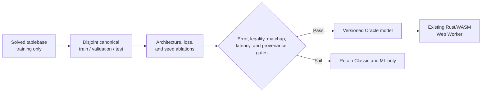

# Oracle AI

Oracle AI is a compact neural opponent distilled from the published strong solution of the Finkel ruleset. It adds a third, independently useful strategy alongside Classic search and the earlier self-play ML model; neither existing option is replaced.

This is the technical record. The shorter [public account](https://gameofur.org/oracle-ai) explains the result for players.

## Decision

The best practical design for this application is an **exact teacher with a compact value-network student**:

1. Validate and sample the solved tablebase outside the repository.
2. Convert each sampled position to a canonical current-player representation.
3. Train a small network to reproduce the exact pre-roll win probability.
4. Let the Rust rules engine enumerate legal successors and use the network only to value them.
5. Ship the model through the existing local Rust/WebAssembly Worker path.

This design improves the source of supervision rather than merely increasing the old self-play run. It preserves local-first play, keeps the browser download small, avoids another inference runtime, and creates measurable error against an exact reference.



## Why the tablebase is suitable

Padraig Lamont and Jeroen Olieslagers strongly solved the Finkel ruleset in 2025 using Bellman value iteration. Their artifact stores the light-player win probability for every reachable pre-roll state. Player symmetry reduces roughly 276 million reachable states to **137,892,016 stored entries**.

The tablebase header declares the configuration used by this application: a standard board, Bell's path, seven pieces, four binary dice, safe rosettes, extra rolls on rosettes, and no extra roll for captures. The trainer rejects different settings and pins the 827,352,312-byte artifact by SHA-256:

```text
d0f33ba40f01b81527d30664d576d8920e06dea6459be966e06e4f704e8e9092
```

The solution is an open author-published report and MIT-licensed artifact, not an independently peer-reviewed formal proof. The integration therefore validates the declared rules, pins the file identity, tests local transitions, and retains two independent opponents.

## Patterns

| Pattern | Invariant | Consequence |
| --- | --- | --- |
| Exact teacher / compact student | Labels come from solved-game probabilities, never a heuristic score. | More training cannot amplify a search evaluator's preferences. |
| Canonical current-player view | Inputs describe the side to move as `current`, regardless of display colour. | One model handles either player without objective inversion. |
| Semantic occupancy | Identical pieces are represented by occupied squares and counts, not persistent piece numbers. | Renumbering equivalent pieces cannot change a prediction. |
| Legal successor enumeration | The rules engine creates candidate states; the network only evaluates them. | Invalid-action masking and a policy head are unnecessary. |
| Soft value distillation | Targets retain win probabilities rather than only the best action. | Calibration, close alternatives, and absolute error remain measurable. |
| Evidence-gated scaling | A pilot selects architecture and loss before the production run. | Compute follows measured evidence rather than intuition. |
| Immutable provenance | Data, configuration, code, samples, candidates, and artifacts have recorded identities. | A deployed result can be audited and reproduced. |
| Strategy behind a shared port | Oracle uses the same typed Worker transport and normalized store result as the other AIs. | Adding an engine does not fork game orchestration. |

These patterns extend the project-wide [architecture catalogue](./ARCHITECTURE.md#pattern-catalogue); they are not a separate architecture.

## Canonical feature schema

`canonical-finkel-v1` contains 32 normalized values:

1. Six private-square occupancy values for the current player, in track order.
2. Six private-square occupancy values for the opponent.
3. Eight shared-lane occupancy values for the current player.
4. Eight shared-lane occupancy values for the opponent.
5. Current and opponent reserve counts, divided by seven.
6. Current and opponent finished counts, divided by seven.

The schema contains no colour identity, dice roll, handcrafted strategy score, duplicated feature, padding, or persistent piece number. Dice are excluded because the tablebase describes a position before the next roll.

The network is `32 → 128 → 128 → 64 → 1`, with ReLU hidden layers and a tanh output mapped to a probability. It has 29,057 learned parameters. This shape was selected by the pilot, not chosen after the production result was known.

## Move selection

For a known roll, Rust enumerates every legal move and evaluates its resulting pre-roll state:

- An immediate winning move has value `1`.
- After a normal move, the opponent becomes current, so the mover's value is `1 - V(successor)`.
- After landing on a rosette, the mover stays current, so the value is `V(successor)`.

The highest value wins. Equivalent reserve pieces produce equivalent successors, with the lowest stable piece index as the deterministic tie-break. No capture, finish, rosette, or policy bonus is added after training.

## Training and reproducibility

The tablebase is external scratch data and must never be committed. Download the pinned artifact to `~/Desktop/rgou-training-data/finkel.rgu`, then run:

```bash
npm run train:oracle:pilot
npm run train:oracle:production
```

`ml/config/oracle-training.json` is the experiment specification. `ml/scripts/oracle_tablebase.py` validates the header and provides the scalar reference decoder. `ml/scripts/train_oracle.py`:

1. verifies the tablebase hash and declared rules;
2. memory-maps the file and samples without replacement with seed `20250715`;
3. partitions that sample into disjoint train, validation, and test sets;
4. cross-checks vectorized feature extraction against the reference decoder;
5. trains every configured architecture, loss, and seed with early stopping and best-checkpoint restoration;
6. selects the lowest validation MAE and evaluates the test set once; and
7. exports matrices in Rust's expected order with configuration, code, tablebase, sample, and source identities.

The pilot uses 200,000 training, 25,000 validation, and 25,000 test positions across two network shapes, MSE and Huber loss, and two seeds. It selected the current architecture with Huber loss and seed 42. Its held-out test MAE was **0.00658** and p95 absolute error was **0.01672**. In a 900-game exploratory matrix it averaged **87.2%** against the other nine engines; that small stochastic run justified scaling but is not the final comparison.

The production preset uses 2,000,000 training, 100,000 validation, and 100,000 test positions, with three seeds. The wrapper uses `caffeinate` on macOS so a long run is not interrupted by system sleep.

## Production result

The production search selected Huber loss, seed `42`, and the best checkpoint from 30 completed epochs. Errors below are absolute win-probability error; the percentage-point form is shown for intuition.

| Split | MAE | RMSE | p95 | Maximum |
| --- | ---: | ---: | ---: | ---: |
| Validation · 100,000 positions | 0.003437 · 0.344 points | 0.004526 · 0.453 points | 0.008864 · 0.886 points | 0.068689 · 6.869 points |
| Test · 100,000 unseen positions | 0.003437 · 0.344 points | 0.004510 · 0.451 points | 0.008841 · 0.884 points | 0.059898 · 5.990 points |

The test MAE is **47.8% lower** and test p95 error is **47.1% lower** than the pilot. The source/JSON artifact is 751,580 bytes; deterministic gzip is 275,643 bytes, **82.3% smaller** than the deployed self-play ML gzip. Model and deployment identities are pinned in `ml/oracle-model-manifest.json`:

```text
source + JSON  9818daa0e0170e2497a697b8563cef1ebbcb7f6eefcc497e90763e1f31c8f16a
gzip           cd67d3e1721d30f3342688160e47f8b511057a618676b5d159b6b70ef6e0a79a
```

The final generated matrix played 50 games for each of 45 pairings, alternating seats. Oracle averaged **93.1%** across its nine opponents, including **88%** against the deployed self-play ML model and **92%** against expectiminimax depth 3. It averaged **1.6 ms per move** on the test machine, versus 79.2 ms for the deployed ML model and 24.6 ms for depth 3. These stochastic cells establish a large practical difference; they are not precise estimates of small matchup edges.

## Evaluation and promotion

A candidate is promoted only when all of these independent checks pass:

1. Held-out mean and p95 probability error improve on the pilot baseline.
2. Python tablebase decoding and Rust runtime encoding agree on shared canonical feature fixtures.
3. Rust unit, rule-conformance, and browser end-to-end tests find no illegal move or perspective error.
4. Paired results materially improve on the self-play ML model with seats alternated.
5. Results remain competitive with Classic and the strongest practical matrix opponent.
6. Browser latency and compressed size improve on the existing ML model.
7. Source model, public JSON, deterministic gzip, configuration, code, sample, and tablebase identities agree.

The checked-in [AI matrix](./AI-MATRIX-RESULTS.md) is generated, not hand-edited. Its normal 50-game cells have wide uncertainty and demonstrate broad differences, not statistical proof of small advantages. Tablebase error is the primary quality measure because it compares predictions with the exact teacher directly.

## Alternatives considered

| Approach | Reason not selected |
| --- | --- |
| Deploy the complete tablebase | Exact but about 827 MB before browser caching; disproportionate for an offline game. |
| Run deeper expectiminimax only | Improves Classic incrementally but remains slower and has no exact supervised error signal. |
| Scale the existing self-play model | More examples would still inherit expectiminimax labels and its padded, index-sensitive representation. |
| Imitate only the optimal move | Discards value margins, complicates equivalent-action labels, and provides weaker diagnostics. |
| Reinforcement learning from scratch | Expensive and unnecessary when exact values already exist for every reachable state. |
| Add ONNX Runtime or WebGPU | The small dense network runs quickly in existing Rust/WASM; another runtime adds download and operational cost without demonstrated benefit. |

## Trust and limitations

Oracle is an approximation: the tablebase is exact to its stored 16-bit precision, while the network generalizes from a sample. Rare regions may have larger errors than the aggregate metrics, and a value approximation can rank very close moves incorrectly. The name describes the teacher, not a claim that every deployed move is mathematically perfect.

The model runs entirely in the browser. No position, move, or personal result is sent to an AI service. Only the same anonymous lifecycle telemetry described in [ARCHITECTURE.md](./ARCHITECTURE.md#persistence-and-analytics) is available when online.

## Sources

- [Strongly Solving the Royal Game of Ur — report](https://royalur.net/file/solved/Solving_the_RGU_Report.pdf)
- [Strongly Solving the Royal Game of Ur — explanation](https://royalur.net/blog/solved)
- [RoyalUr solved-model repository](https://huggingface.co/sothatsit/RoyalUrModels)
- [RoyalUr Python reference implementation](https://github.com/RosetteGames/royalur-python)
- [Distilling the Knowledge in a Neural Network](https://arxiv.org/abs/1503.02531)
